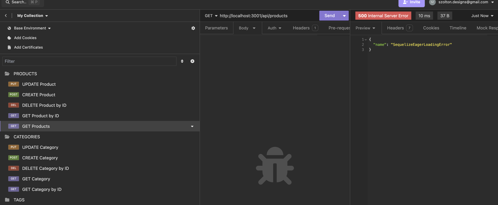
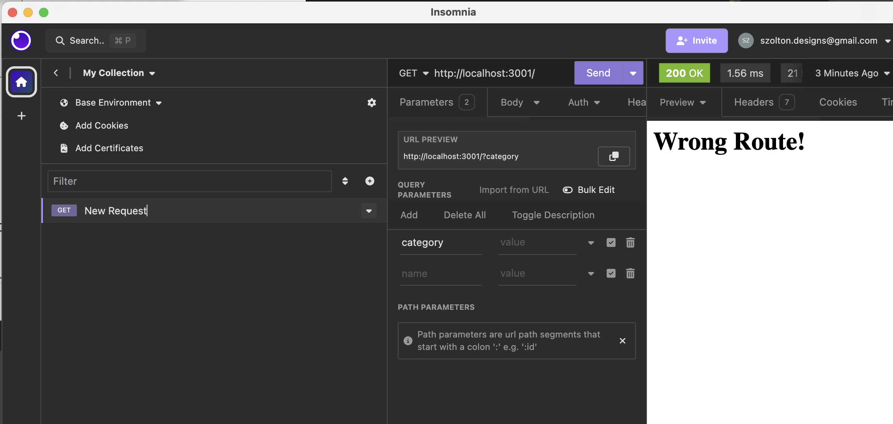
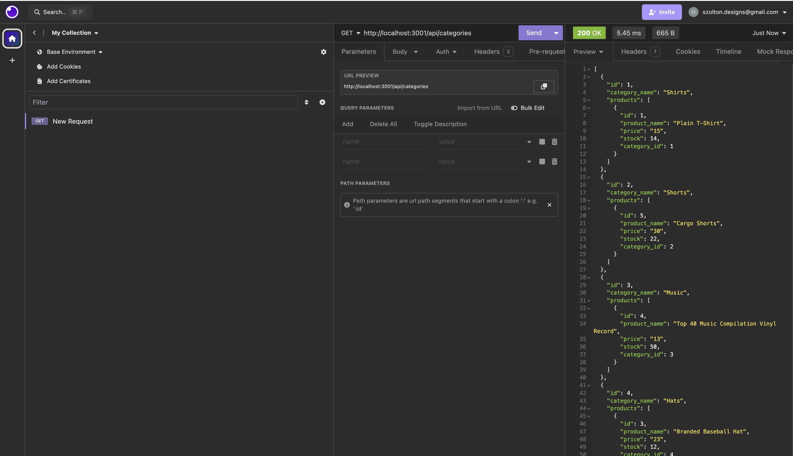

# Object-Relational Mapping (ORM) Challenge: E-commerce Back End

The purpose of this project was to build a back end for an e-commerce site. I took a working express.js API and configured it to use sequelize to interact with a MySQL database. Developers should understand the fundamental architecture of e-commerce sites and how they work together.

# User Story
AS A manager at an internet retail company
I WANT a back end for my e-commerce website that uses the latest technologies
SO THAT my company can compete with other e-commerce companies

# Process
For this assignment, I relied on youtube videos such as this: https://www.youtube.com/watch?v=1ONhXmQuWP8, https://www.youtube.com/watch?v=fzLPHpOP3Wc, tutors, and previous coursework to complete the challenge.

I began by researching, downloading all the tools (mySQL, Sequelize, etc) and got to work. I started by creating a database on mysql, adding the proper file structure and files from the starter code, and got to work. I have a deeper understanding of how routes, models, and config/server.js all work together now, and the hardest part was understanding how to use insomnia.

You can see in this screenshot some of the different errors I had to work through.

Basic youtube videos like this one really helped me visualize how to use insomnia for the project: https://www.youtube.com/watch?v=b3jgsfbJijw

Here's a screenshot of how Insomnia pulled the tags that you'd also see in the demo video:

# In conclusion
I used a functional express.js API to work with a back-end of an ecommerce site
- I added my database name, MySAL username, and MySQL password to an environment variable file
- I connected to the database using sequelize, entered the schema and seed commands, and created a development dataase with test data
- The server starts, and models are synced to the MySQL database
- In insomnia, you can open the API GET routes for categories, products, or tags
- You can test API POST, PUT, and DELETE routes in Insomnia
- You can then create, update and delete data in the database successfully 

# Links

Please see here for my video walkthrough: https://vimeo.com/949955438

Please see here for the link to my GitHub: https://github.com/szolton/Object-Relational-Mapping-ORM-Challenge-E-commerce-Back-End
